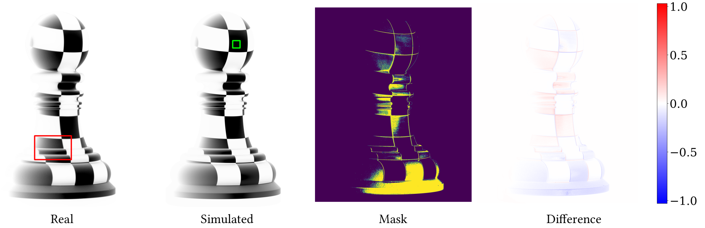
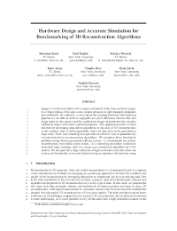
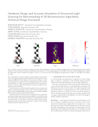
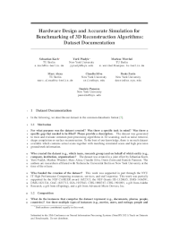
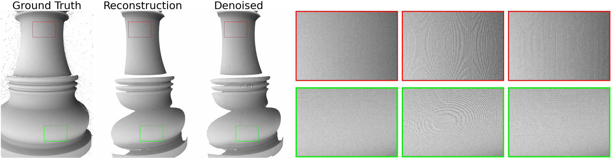
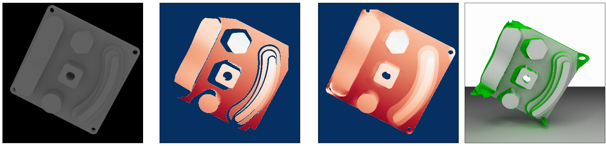
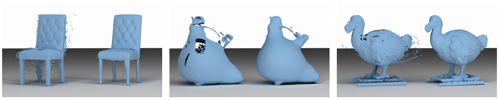

# News

> **(2021, August 27th)** Initial release including scanning simulation framework, physical dataset, synthetic dataset and benchmarks.<br>


* * *
<br>


# Paper

We co-develop a 3D structured light scanning hardware setup together with a corresponding light transport simulation with the objective of minimizing the difference of per-pixel values. For diffusely reflecting objects we show that differences between the real image taken by the camera and the synthesized image are negligible. This provides an ideal test-bed for developing data-driven algorithms in the area of 3D reconstruction, as the synthetic data is indistinguishable from real data. Pixel-wise matching also provides an effective way to evaluate data-driven reconstruction algorithms objectively.

 
We introduce three benchmark problems using the data generated with our system: (1) a benchmark for surface reconstruction from dense point clouds, (2) a denoising procedure tailored to structured light scanning, and (3) a range scan completion algorithm for CAD models, trained on the ABC CAD dataset. We also provide a large collection of high-resolution scans that allow our system and benchmarks to be used without having to reproduce the hardware setup.




### Authors
Koch, Sebastian and Piadyk, Yurii and Worchel, Marcus and Alexa, Marc and Silva, Claudio and Zorin, Denis and Panozzo, Daniele


### Acknowledgements

The work was supported in part through the NYU IT High Performance Computing resources, services, and staff expertise. This work was partially supported by the NSF CAREER award 1652515, the NSF Grants IIS-1320635, DMS-1436591, DMS-1821334, OAC-1835712, OIA-1937043, CHS-1908767, CHS-1901091, a gift from Adobe Research, a gift from nTopology, and a gift from Advanced Micro Devices, Inc.


### Documents


<!--<div style="display: flex; justify-content: center; margin-bottom:20px;">-->
<a href="data/scan_sim_paper.pdf" target="_blank"></a>
<a href="data/scan_sim_technical.pdf" target="_blank"></a>
<a href="data/scan_sim_dataset.pdf" target="_blank"></a>
<!---->
<!--</div>-->

Please cite our paper if you use the LSD dataset or our scanning simulation to generate data.

```
@InProceedings{Koch_Piadyk_2021,
tbd.
}
```

### License

The code is available partly under the [MIT license](https://opensource.org/licenses/MIT){:target="_blank"} and partly under the [GPL 3.0 license](https://www.gnu.org/licenses/gpl-3.0.en.html){:target="_blank"}.

Our datasets are available under the [CC BY 4.0 license](https://creativecommons.org/licenses/by/4.0/){:target="_blank"} except for the 7 textured/colored 3D models, which are licensed by their respective creators under various Creative Commons licenses (see supplementary material).

By downloading the dataset or software framework you agree to the following terms:

* The authors give no warranties regarding the dataset or the software framework.


* * *
<br>


# Dataset


Our dataset consists of the following parts. The files are hosted on NYU digital archive. If you notice download problems, try to limit the amount of concurrent downloads.


### Calibration Data

For the calibration of the physical scanner, we recorded a larger set of raw data. **The raw calibration data can be downloaded from [here](https://archive.nyu.edu/handle/2451/63307){:target="_blank"}**. This data can be used to understand the calibration process or to reproduce the calibration on a recreated hardware setup. 

In addition to the raw data, we also supply the processed calibration data that can be used to process physical scans as well as to set up and run the scan simulation. **This data can be found [here](https://github.com/geometryprocessing/scanner-sim/tree/master/scanner/calibration){:target="_blank"}**.


### Physical Scans 

 **The physical scan data can be downloaded from [here](https://archive.nyu.edu/handle/2451/63306){:target="_blank"}**. Each scan from the physical scans comprises the following files:

| Format         | Description          | Amount | Example |
|:---------------|:---------------------|:-------|:--------|
| HDR Image (exr)    | Unprocessed HDR images acquired for different rotating stage positions and collections of patterns, such as gray codes and uniform color | 47*12 | [exr](data/img_40.exr){:target="_blank"} | 
| HDR Image (exr)    | Unprocessed HDR images acquired in the initial or final position of the rotating stage for additional collections of patterns, such as micro-phase shifting or unstructured light | - | [exr](data/leo_010.exr){:target="_blank"} | 
| HDR Image (exr)    | A background image with scanned object removed | 1 | [exr](data/background.exr){:target="_blank"} | 
| LDR Image (jpg)    | A photo of the setup with object installed | 1 | [jpg](data/pawn.jpg){:target="_blank"} | 
| Textfile (txt)    | A brief description of the scanning conditions and settings | 1 | [txt](data/setup_description.txt){:target="_blank"} | 
| Script (txt)    | A scanning script used to acquire the HDR images | 1 | [sh](data/complete_multiscan.script){:target="_blank"} | 


### Synthetic Scans

**The sythetic scan data chunks can be downloaded from [here](https://archive.nyu.edu/handle/2451/63308){:target="_blank"}**. Currently only the first chunk is available. Each scan from the synthetic scans comprises the following files:

| Format         | Description          | Name | Example |
|:---------------|:---------------------|:-----|:-----|
| HDR Image (exr)    | Scan images of 3D objects illuminated with ambient light and white projector light | 47 | [exr](data/img_014.exr){:target="_blank"} | 
| LDR Image (png)    | Scan images of 3D objects illuminated with ambient light and white projector light | 47 | [png](data/img_014.png){:target="_blank"} | 
| Depthmap (npy)    | Depth maps from reconstruction and ground-truth | 2 | [npy](data/depth_gt.npy){:target="_blank"} | 
| Pointcloud (ply)    | Reconstructed point cloud | 1 | [ply](data/group_points.ply){:target="_blank"} | 
| Mesh (obj)    | The original object geometry/mesh | 1 | [obj](data/pawn.obj){:target="_blank"} | 


<!--### Checksums/Sizes
We provide md5 checksums and filesizes (in bytes) for all compressed chunks in the following yaml files to check for archive integrity: &emsp;
[md5](data/md5.yml){:target="_blank"}&emsp;
[size](data/size.yml){:target="_blank"}

-->

* * *
<br>


# Benchmarks

Based on a subset of the scanned models from our dataset, we provide the following benchmarks for three different post processing applications. **The code and data for all benchmarks can be downloaded from [here](https://archive.nyu.edu/handle/2451/63309){:target="_blank"}.**

### Denoising



Minor inaccuracies in the calibration and errors in triangulation result in subtle errors in the reconstructed depth. In contrast to outliers that can occur when scanning highly specular objects, these imperfections are located on a much smaller scale (millimeter to submillimeter), a challenging problem that is very relevant for metrology applications. Despite the large body of work in machine learning and depth map processing, we are unaware of any related work in the structured light scanning context that tries to correct errors at this scale in a data-driven way, likely due to the lack of a data generator or acquisition setup for this problem.
We use our approach to build such a dataset and propose a baseline method that casts the task as an image-to-image translation problem and train a convolutional neural network on pairs of reconstructed and ground truth depth maps. 


### Shape Completion



Shape Completion (sometimes also referred to as shape inpainting, hole filling, or depth completion) is a common postprocessing task in 3D scanning. 
We generate 100k crops of size 320x256. Each sample consists of an image crop from the diffusely illuminated rendering, the corresponding ground truth depth map as well as the reconstructed depth map from the virtual scanning process. 
In contrast to images with projector illumination, the diffusely illuminated ones provide the network with information about areas not hit by projector light rays. 
We use a data-driven approach for depth completion of indoor scenes as a baseline, see the paper and supplementary material for more information on the training regime and architecture.


### Surface Reconstruction



A common downstream task in structured light scanning is assembling a full model of a captured object. For this task, multiple depth maps are fused into one point cloud and a consistent surface is extracted from this unstructured representation. Our system can be used to simulate the scan of any 3D object. We provide scripts to automatically generate an arbitrary number of range scans and fuse them into a single point cloud that can be processed with a 3D reconstruction algorithm. The reconstructed geometry can then be compared with the reference geometry using Hausdorff distance to quantitatively measure the reconstruction error. We provide the script to generate the data and evaluate the reconstructions, and as an example we use them to evaluate the screened Poisson surface reconstruction algorithm. This is not a data-driven approach, but its parameters are context dependent and have to be adapted according to the input data. We use our system to automatically find optimal parameters for a given object.

* * *
<br>


# Software

The software framework is build in Python and C++. We make use of many open source libraries, which can be easily installed with pip or conda. 

### Calibration

We supply the code to run the full calibration procedure in our repository (folder *scanner/calibration*).

### Physical Scanner

The code to capture images is located in our repository in the folder *scanner/capture*.
For the decoding and reconstruction stage, the code is in the folder *scanner/reconstruction*.

### Simulated scanner

For the simulation we provide a Docker container with a preinstalled version of our software package.
The code for the scan simulation is located in our repository in the folder *simulator*. 

To obtain the preinstalled version of the SLS pipeline, you can pull the Docker container that 
runs a Jupyter notebook for easy evaluation.
In order to do so, you need to follow these steps:

1. Install docker according to the [docker documentation](https://www.docker.com/get-started){:target="_blank"}.

2. Pull the anonymized docker demo container with `docker pull fsls/demo`.

3. Run the docker container with `docker run -v <myresults>:/sls/scanner-sim/data/results -p 8888:8888 fsls/demo`.
Replace <myresults> with an accessible folder on your machine, where the results should be stored.

4. Read the jupyter notebook url from the terminal that looks something like: `http://127.0.0.1:8888/?token=d39e4ad140694134cf23ec4ceff4b543211e9b63ecaae531` and open the url in a web browser.

5. Open the 'Structured Light Scanning' notebook and follow the stages from rendering over decoding to reconstruction.


* * *
<br>


